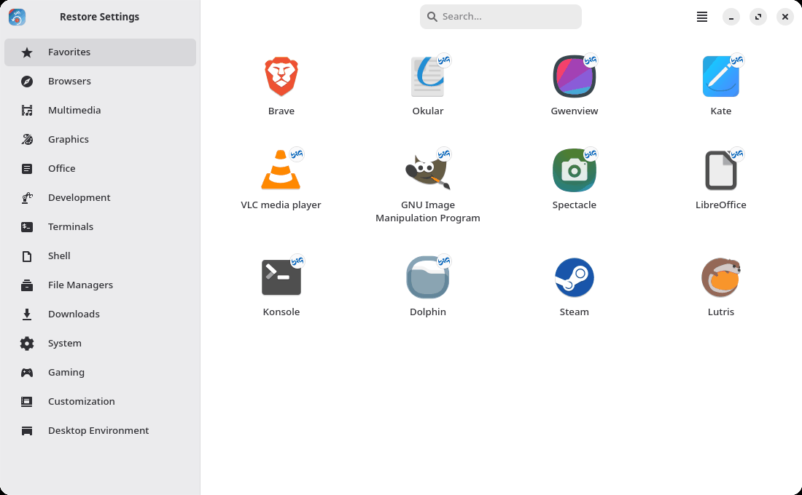
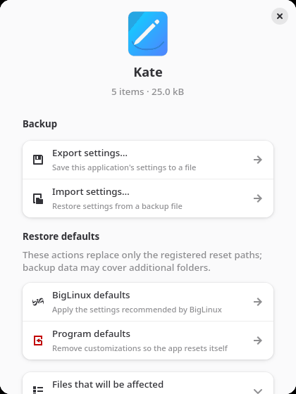
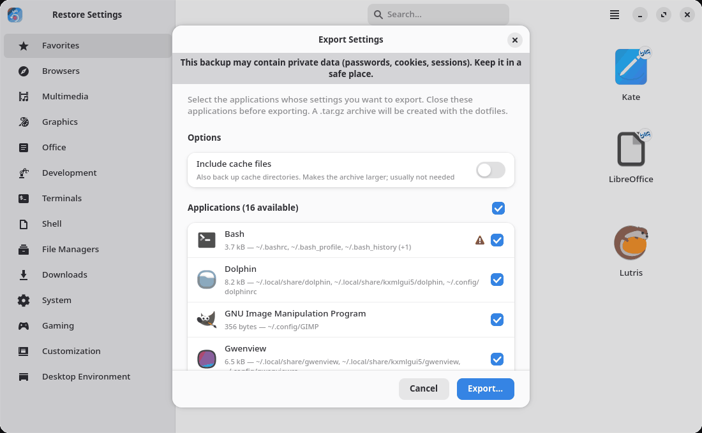
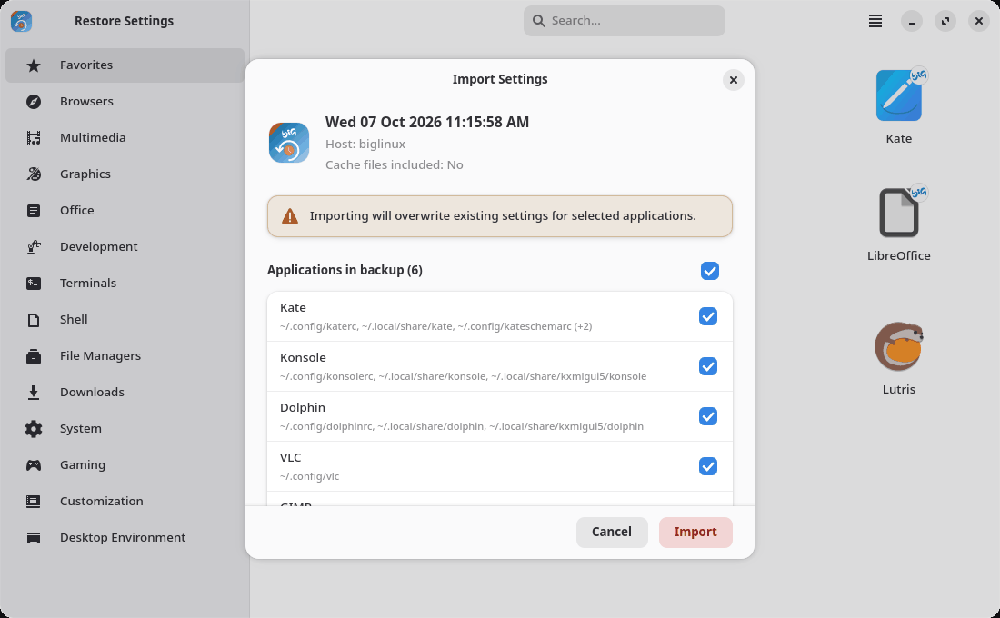
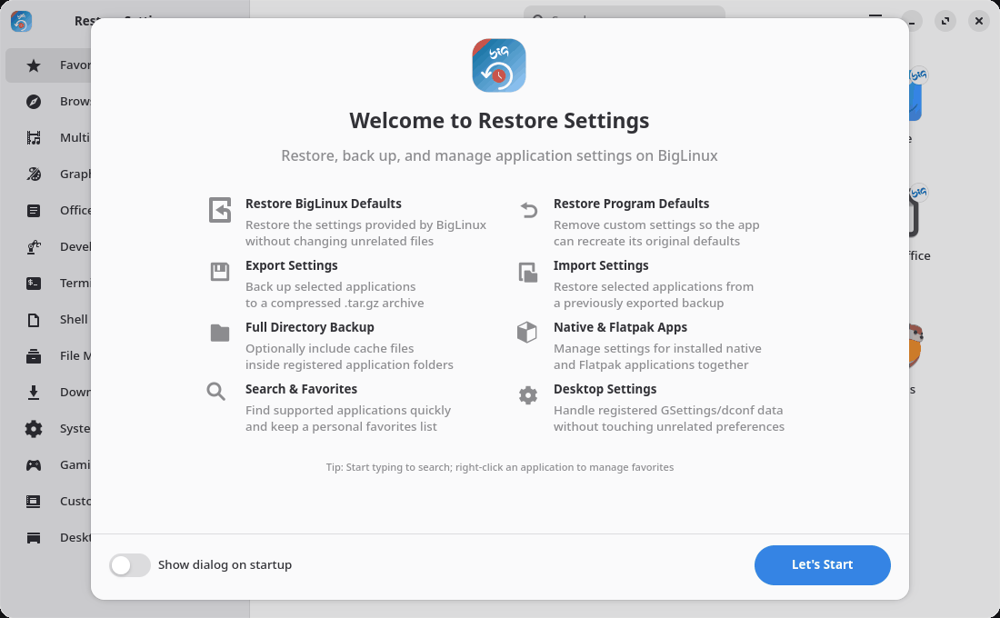
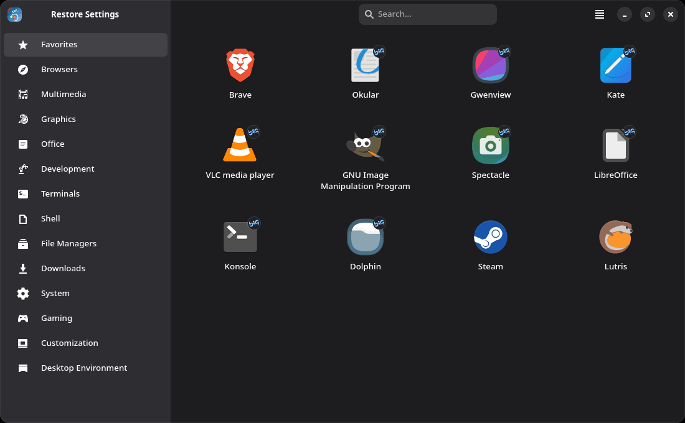

<p align="center">
  
</p>

<h1 align="center">Restore Settings</h1>

<p align="center">
  <strong>Back up, restore and reset application settings on BigLinux.</strong><br>
  Package <code>biglinux-config</code> · GTK 4 and libadwaita
</p>

<p align="center">
  
  <a href="LICENSE"></a>
  
  
  
</p>

<p align="center">
  
</p>

Restore Settings resets, backs up and restores the configuration of the
applications installed on your computer, one application at a time. It knows
where 136 applications keep their settings — browsers, office suites, media
players, editors, terminals, shells, games and desktop environments — and also
handles Flatpak applications and the desktop settings that GNOME-based apps
keep in dconf.

## Features

- **Restore BigLinux defaults** — copy back the settings that BigLinux ships in
  `/etc/skel`, only for the files registered for that application.
- **Restore program defaults** — remove an application's settings so it starts
  again with its own defaults. This removes everything in the registered
  folders — for browsers and mail clients that includes bookmarks, passwords and
  local mail. Shell history, installed Steam games, virtual machine disks and
  Bottles prefixes are never reset.
- **Back up first** — every reset can save a backup of the current settings.
- **Export** the settings of the applications you choose into one `.tar.gz` file.
- **Import** all or some applications from a backup, with integrity checks and
  automatic rollback if anything fails.
- **Native and Flatpak** applications side by side, plus scoped dconf settings.
- **Favorites and search** — your default apps are favorites automatically;
  right-click (or long-press, or <kbd>Menu</kbd>) to add or remove one. Start
  typing anywhere to search.
- Adaptive layout for small windows, light and dark styles, keyboard and
  screen-reader friendly.

## Screenshots

| Per-application actions | Export |
|:---:|:---:|
|  |  |
| **Import** | **Welcome** |
|  |  |

<p align="center">
  
</p>

## Installation

### BigLinux

Install it from the BigLinux repositories:

```bash
sudo pacman -S biglinux-config
```

You can also open it from **BigLinux Control Center** or from the applications
menu as **Restore Settings**.

### Arch Linux and derivatives

The package is not in the Arch repositories. Build it with the PKGBUILD of this
repository; all dependencies come from the official Arch repositories, and no
extra repository is needed:

```bash
git clone https://github.com/ruscher/biglinux-config.git
cd biglinux-config/pkgbuild
makepkg -si
```

`pkgbuild/PKGBUILD` downloads the `v2.0.0` tag of this repository and runs the
test suite before packaging.

### Requirements

| Package | Version | Use |
|---|---|---|
| `python` | 3.12 or newer | runtime |
| `python-gobject` | — | GTK bindings |
| `gtk4` | 4.12 or newer | interface |
| `libadwaita` | 1.6 or newer | interface |
| `glib2`, `pango`, `hicolor-icon-theme` | — | interface, icons |
| `dconf` | — | desktop settings (installed with GTK) |
| `flatpak` | optional | Flatpak applications |

Tested on BigLinux and in a clean Arch Linux container (full test suite,
package build, installation and `biglinux-config --version`).

## Usage

### Restore defaults

1. Click an application. Applications with a **BIG** badge have BigLinux defaults.
2. Choose **BigLinux defaults** or **Program defaults**. The **Files that will be
   affected** list shows exactly which paths are involved.
3. Keep **Create a backup of the current settings** checked (recommended) and
   confirm. If the application is running, Restore Settings offers to close it.

After a desktop-environment reset you are asked to log out.

### Export and import

- **Menu → Export settings…** lists every application that has settings, with
  their size. Applications that can store passwords, cookies or history are
  marked, and the dialog warns you. Choose the destination of the `.tar.gz` file.
- **Menu → Import settings…** opens a backup, shows when and where it was made,
  and lets you pick the applications to restore.
- From an application's dialog you can export or import just that application.

Close the applications involved before exporting or importing.

## Safety

Settings are changed only inside your home folder, and only at the paths
registered for each application.

- Paths are checked before every change. HOME itself, shared folders such as
  `~/.config` or `~/.local/share`, the dconf database and anything reached
  through a symbolic-link folder are never removed or replaced.
- New files are prepared in a private folder first. Originals are moved aside
  and put back automatically if any step fails or you cancel. If even that is
  impossible, they are kept and the error tells you where.
- Backups are checked before anything is changed: every file has a checksum,
  and archives with unexpected paths, absolute or escaping links, duplicate
  members, special files or excessive sizes are refused.
- Backups only restore paths that this version would back up for that
  application, and only its own dconf settings.
- Only one backup, import or reset runs at a time, and the application refuses
  to run as root.

Checksums detect damage, not authorship: **import only backups you trust**, and
keep backups private — browser and chat settings include passwords and
sessions. Details and manual recovery steps are in [docs/SAFETY.md](docs/SAFETY.md).

## Flatpak

When `flatpak` is installed, every Flatpak application with data in
`~/.var/app/<id>` appears in the **Flatpak** category. Backups include its
`config` and `data` folders (not `cache`); **Program defaults** resets only
`config`. Running Flatpak applications are detected with `flatpak ps`.

## Translations

The interface is written in English and translated with gettext into 32
languages. Translations live in `biglinux-config/locale/*.po`; compiled
catalogs are in `biglinux-config/usr/share/locale/`.

```bash
bash tools/i18n.sh          # update the template, merge every .po and compile the .mo files
bash tools/i18n.sh --check  # fail if any catalog is stale or invalid (used by CI)
```

To add a language, copy `biglinux-config/locale/biglinux-config.pot` to
`biglinux-config/locale/<language>.po`, translate it and run `tools/i18n.sh`.

## Development

### Run from source

```bash
git clone https://github.com/ruscher/biglinux-config.git
cd biglinux-config
python3 biglinux-config/usr/share/biglinux/biglinux-config/main.py
```

Running from the checkout uses the translations and icons of the checkout. It
works on your real settings, exactly like the installed application.

### Tests

The tests never touch your settings: every test gets a private HOME and XDG
folders and no access to your session bus.

```bash
bash tools/check.sh           # unit and regression tests
bash tools/check-dconf.sh     # dconf tests in a private D-Bus session
```

Everything CI does runs in a disposable Arch Linux container (the script
installs packages and creates a user, so never run it on your own system):

```bash
podman run --rm -v "$PWD:/src:ro" docker.io/library/archlinux:latest bash /src/tools/ci.sh /src
```

`tools/ci.sh` runs the tests, validates translations, desktop entries, AppStream
data, shell scripts and the PKGBUILD, then builds, installs and starts the
package from the current commit. GitHub Actions runs it on every push and pull
request.

### Releases

The version is defined once, in `ui/metadata.py` (`APP_VERSION`). The test suite
fails unless `pkgbuild/PKGBUILD` (`pkgver`) and the AppStream release agree with
it. Tag the release as `v<version>` and push the tag together with the commit,
because the PKGBUILD builds from that tag. The PKGBUILD has `epoch=1` because
older builds used date versions such as `2026_10_02`; keep it.

### Project structure

```
biglinux-config/                     installed tree (copied to / by the PKGBUILD)
├── locale/                          translation sources (.pot, .po)
└── usr/
    ├── bin/biglinux-config          launcher (big-config is a compatibility link)
    └── share/
        ├── applications/            menu entry and BigLinux Control Center entry
        ├── biglinux/biglinux-config/
        │   ├── main.py              entry point and runtime checks
        │   ├── backend/             detection, backup, reset, paths, transactions, dconf
        │   ├── data/app_registry.py the 136 supported applications and categories
        │   └── ui/                  GTK 4/libadwaita windows and dialogs
        ├── icons/                   application icon
        ├── locale/                  compiled translations (.mo)
        └── metainfo/                AppStream metadata
docs/                                safety notes and screenshots
pkgbuild/PKGBUILD                    Arch package
tests/                               pytest suite
tools/                               test, translation and CI scripts
```

### Adding an application

Add an `AppEntry` to `APP_REGISTRY` in `data/app_registry.py`:

```python
AppEntry(
    app_id="my-app",
    name="My App",
    icon="my-app",                        # icon name from the icon theme
    binary="/usr/bin/my-app",             # used to detect the installation
    category="multimedia",
    config_paths=["~/.config/my-app"],    # what a backup contains
    skel_paths=["/etc/skel/.config/my-app"],  # optional BigLinux defaults
    # reset_paths=[...]  narrower than config_paths when the app also keeps
    #                    personal data; [] for backup-only applications
)
```

`tests/test_registry.py` rejects duplicates, paths outside HOME, reset paths
that the safety backup would not cover, and resets of shared folders.

## Troubleshooting

- **An installed application is missing** — its executable must exist at the
  path registered in `app_registry.py`. Flatpak applications appear after they
  have been started once (their `~/.var/app` folder must exist).
- **"Close the application and try again"** — a file changed or was in use while
  the backup was made. Close the application, including tray icons, and retry.
- **A link was not included** — links pointing outside your home folder cannot
  be restored safely and are left out of backups; the result lists them.
- **Recovery is required** — do not delete the folder named in the message
  (`~/.biglinux-config-restore-*` or `~/.biglinux-config-reset-*`); it holds your
  previous files. See [docs/SAFETY.md](docs/SAFETY.md#manual-recovery).
- **Logs and safety backups** are in `~/.local/state/biglinux-config/`.

Please report problems with the exact message at the
[issue tracker](https://github.com/ruscher/biglinux-config/issues).

## Authors

- **Rafael Ruscher** — [@ruscher](https://github.com/ruscher)
- **Bruno Gonçalves** — [@bigbruno](https://github.com/bigbruno)

## License

Restore Settings is free software under the
[GNU General Public License v3.0 or later](LICENSE).

## Links

- Repository: <https://github.com/ruscher/biglinux-config>
- Issues: <https://github.com/ruscher/biglinux-config/issues>
- BigLinux: <https://www.biglinux.com.br/>
